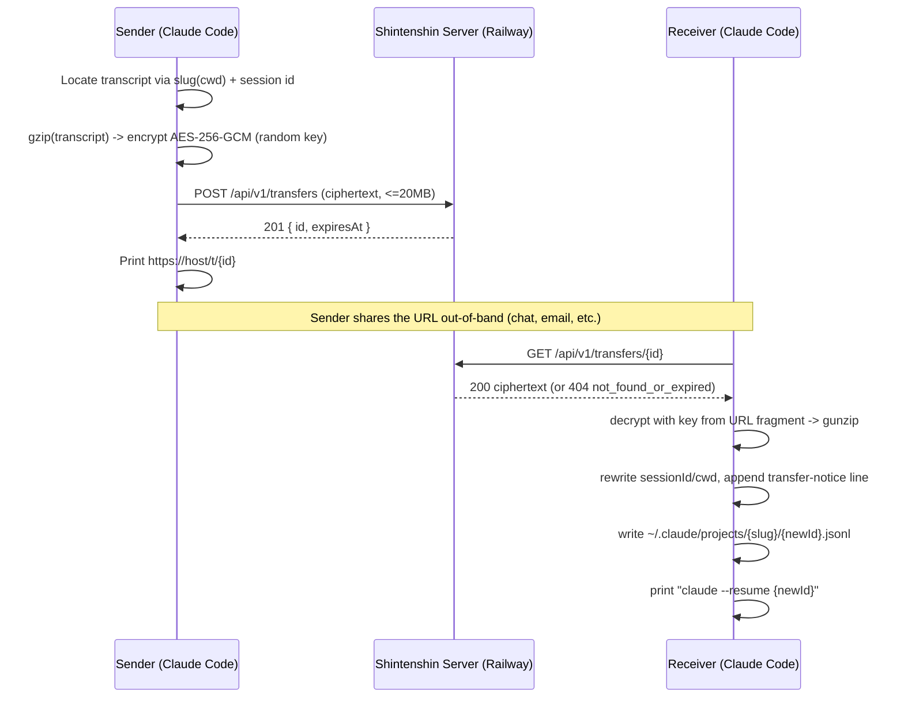

# Shintenshin (心転身) — Product Requirements Document

**Status:** Draft for launch v0.1.0
**Owner:** Raj Talekar (GitHub: `seal-7`)
**Last updated:** 2026-07-04

---

## 1. Overview & Lore

**Shintenshin no Jutsu** (心転身の術, "Mind-Body Switch Technique") is a jutsu used by the
Yamanaka clan in *Naruto*: the user projects their consciousness into another body, taking
it over while their own goes limp. It's a technique about *transferring a mind into a new
vessel* — which is exactly what this tool does with a Claude Code conversation.

**Shintenshin** is a Claude Code plugin that lets you export your entire current
conversation — every message, tool call, and piece of context — as a single encrypted
link. Whoever opens that link, from their own machine, can pull your conversation into
their own Claude Code and pick up exactly where you left off, with full history intact.

### Origin story

The author was deep into a documentation-writing session with Claude Code — several
hours of back-and-forth, decisions made, context accumulated — when he needed to step
away and hand it off. The natural thing to want was: *just send my wife the conversation
so she can keep going.* No such mechanism existed. Copy-pasting scrollback loses tool
calls, file state, and nuance; screen-sharing requires both people to be present at once.
Shintenshin is the tool that should have already existed for that moment.

---

## 2. Problem Statement

Claude Code conversations accumulate valuable context — decisions, half-finished
reasoning, tool outputs, exploration dead-ends — that lives only in a local JSONL
transcript on one machine, tied to one person. Today, the only way to "hand off" a
session is to:

- describe it in prose to the next person (lossy, slow), or
- share your screen / pair in real time (requires synchronous availability), or
- copy the raw JSONL file by hand (requires knowing it exists, where it lives, and how
  `--resume` works — undocumented internals most users have never touched).

There is no lightweight, asynchronous, secure way to say "here, take over from where I
am" and have the receiving person land in a fully-loaded, resumable Claude Code session.

---

## 3. Personas & User Stories

### Persona A — The Handoff (teammate or spouse)
Someone who needs to stop working and pass an in-progress session to another specific
person, synchronously or asynchronously.

- *As a developer stepping away from a debugging session, I want to send my exact
  conversation state to a teammate, so they can continue without re-explaining
  everything I've already discovered.*
- *As someone who started a task and needs to hand it to a family member with less
  technical context, I want them to be able to import my session with one command and
  see a friendly note explaining what happened, so they aren't confused when Claude
  starts talking about "the transfer."*

### Persona B — Self-Transfer
The same person, moving a session between two machines they own (laptop → desktop, work
→ personal).

- *As a developer who started a conversation on my laptop, I want to continue it on my
  desktop tonight, so I don't lose the context built up during the day.*

### Persona C — Community Sharing
Someone who had an interesting, instructive, or funny Claude Code session and wants to
share it publicly as a talking point or teaching example.

- *As a Claude Code power user, I want to share a link to an interesting session in a
  Discord or Slack, so others can load it up and see exactly how the conversation
  unfolded, tool calls included.*

Common thread across all three: **the transfer must be trivial (one command, one link)
and must not require the sender and receiver to coordinate in real time.**

---

## 4. UX

Shintenshin ships as a Claude Code plugin exposing two slash commands, backed by two
skills: `send` and `receive`.

### 4.1 `/shintenshin:send`

Run from inside the conversation you want to hand off. No arguments.

**Flow:**
1. Claude invokes the `send` skill, which runs `scripts/send.mjs` using the current
   session's ID (`$CLAUDE_CODE_SESSION_ID`) and cwd.
2. The script locates the transcript, gzips it, encrypts it client-side with a random
   AES-256-GCM key, and uploads only ciphertext to the server.
3. Claude relays the script's output to the user.

**Sample terminal output:**

```
> /shintenshin:send

Locating transcript for session a3f9c1e2-... in /Users/raj/workspace/docs-site
Transcript found (412 KB, 1,204 lines)
Compressing... done (98 KB gzipped)
Encrypting (AES-256-GCM, local key, never leaves this script)... done
Uploading to https://share.shintenshin.com ... done

Your conversation is ready to hand off:

  https://share.shintenshin.com/t/QwErTy1234567890AbCdEf#kX9f...Zq2

Expires: 2026-07-11 (7 days from now)

⚠ Anyone with this link can import this conversation. Treat it like a password —
  share it only with the person you intend to hand off to.

Send that link to whoever should continue this conversation. They can run
/shintenshin:receive <link> in their own Claude Code to pick up from here.
```

**Failure modes surfaced clearly:** no transcript found for this session, network error
reaching the server, non-201 response from the server (e.g. rate limited).

### 4.2 `/shintenshin:receive <url>`

Run from the project directory where the recipient wants the conversation to live.

**Flow:**
1. Claude invokes the `receive` skill with `$ARGUMENTS` (the pasted URL), running
   `scripts/receive.mjs <url>`.
2. The script parses the blob id and decryption key out of the URL, downloads the blob,
   verifies and decrypts it, rewrites session identifiers, injects a transfer-notice
   message, and writes a new transcript file into the receiver's own
   `~/.claude/projects/<slug>/` directory.
3. Claude relays the result and tells the user the exact next command to run — a
   **new** `claude --resume` invocation, since a running session cannot resume into
   itself.

**Sample terminal output:**

```
> /shintenshin:receive https://share.shintenshin.com/t/QwErTy1234567890AbCdEf#kX9f...Zq2

Fetching blob QwErTy12... 98 KB
Decrypting... done
Decompressing... done (1,204 lines)
Rewriting session identifiers for this machine...
Writing transcript to ~/.claude/projects/-Users-mika-workspace-docs-site/7c2e...jsonl

Transfer complete. New session id: 7c2e1f80-9b3a-4e11-8d2a-5f0a1c9e2b77

To continue this conversation, run (from this directory):

  claude --resume 7c2e1f80-9b3a-4e11-8d2a-5f0a1c9e2b77

When you resume, Claude will greet you and summarize where things left off.
```

**Failure modes surfaced clearly:** malformed URL, 404/expired blob, GCM auth failure
("wrong or corrupted link" — never a raw crypto stack trace).

### 4.3 Landing page (browser view of the share URL)

If a human opens the link in a browser instead of pasting it into Claude Code, `GET
/t/:id` serves a self-contained, dark ninja-themed HTML page:

- Headline: "Shintenshin — a mind transfer awaits you."
- One line of lore.
- Numbered instructions: install the plugin, then run `/shintenshin:receive <full URL>`
  from Claude Code, with an explicit reminder that the URL fragment (`#...`) *is* the
  decryption key and must be pasted in full.
- A line stating blobs expire after 7 days and the server never sees the plaintext.
- Footer link to the GitHub repo.
- If the blob is missing/expired, the same page renders an "this transfer has expired
  or was not found" state instead of the instructions.

---

## 5. Product Decisions

| Decision | Choice | Rationale |
|---|---|---|
| **Scope** | Conversation transcript only — no files, no git state, no workspace bundling | Keeps the crypto payload small, the security model simple, and the tool auditable. Files are the receiver's own responsibility; this is called out explicitly as a "side effect of the jutsu" rather than hidden. |
| **Privacy model** | End-to-end encryption: AES-256-GCM, random key generated client-side, key travels only in the URL fragment (`#...`), which browsers and servers never transmit over the wire. Server stores and serves opaque ciphertext blobs. | The transcript may contain proprietary code, credentials, or private conversation content. A server breach or subpoena should not expose plaintext. Putting the key in the fragment is a well-established pattern (e.g. Firefox Send) for "server-blind" sharing without any account system. |
| **Retention** | 7-day auto-expiry, swept hourly | Bounds server storage growth indefinitely without requiring user action; long enough for realistic async handoffs (a slower colleague, a different timezone), short enough to limit the exposure window of a leaked link. |
| **Naming** | `shintenshin`, commands `/shintenshin:send` / `/shintenshin:receive` | Namespaced under the jutsu name avoids collision with generic verbs like `/send`; matches the plugin's identity end-to-end (repo, commands, landing page copy). |
| **Browser view of link** | Themed landing page rather than a bare JSON/404 response | Anyone who receives a link and doesn't have Claude Code installed (or opens it out of curiosity) lands on something legible and on-brand instead of a broken API response — and it doubles as a lightweight distribution/discovery surface. |
| **Hosting** | Railway, using an existing subscription | Zero incremental cost to launch today; volume-backed storage is sufficient for a blob store with hourly TTL sweeps; no need to stand up new infra accounts. |

---

## 6. Architecture

### 6.1 Components

1. **Plugin** (repo root) — Claude Code plugin containing:
   - `commands/send.md`, `commands/receive.md` — thin command wrappers.
   - `skills/send/SKILL.md`, `skills/receive/SKILL.md` — skill definitions invoked by
     the commands.
   - `scripts/send.mjs`, `scripts/receive.mjs` — the actual logic (locate transcript,
     encrypt/decrypt, network calls, transcript rewriting).
   - `scripts/lib.mjs` — shared helpers: cwd slugification, AES-256-GCM crypto, gzip.
2. **Server** (`server/`) — a minimal Node + Express service deployed on Railway:
   - Accepts encrypted blob uploads, stores them on a persistent volume, serves them
     back by id, sweeps expired blobs, serves the landing page.

### 6.2 Sequence diagram



The URL fragment (containing the decryption key) is never sent to the server by the
browser or any HTTP client — it is only ever read locally by the receiving script.

### 6.3 API endpoints

| Method & Path | Purpose | Notes |
|---|---|---|
| `POST /api/v1/transfers` | Upload an encrypted blob | Body: `application/octet-stream`, max 20 MB (413 beyond). Validates the `"ST01"` magic header (400 otherwise). Generates a 22-char base64url `id` from 16 random bytes. Returns 201 `{"id": "...", "expiresAt": "<ISO, now+7d>"}`. |
| `GET /api/v1/transfers/:id` | Download a blob by id | Validates `id` matches `[A-Za-z0-9_-]{22}`. Returns 200 octet-stream, or 404 `{"error":"not_found_or_expired"}`. |
| `GET /t/:id` | Themed HTML landing page for a specific transfer | 200 even when the blob is missing — renders an expired/not-found state via a lightweight existence check. |
| `GET /` | Generic landing page (no id) | Same template, generic copy. |
| `GET /healthz` | Health check | 200 `{"ok":true}`. |

### 6.4 Storage & TTL

- Blobs are written to `<DATA_DIR>/<id>.bin` (`DATA_DIR` env, default `./data`,
  created on boot if missing) on a Railway persistent volume.
- An hourly `setInterval` sweep (plus one sweep at boot) deletes any `*.bin` whose mtime
  is older than 7 days.
- No database — the filesystem is the store; `id` is the only key.

### 6.5 Limits

- **20 MB** max upload size, enforced at the HTTP layer (413 beyond).
- **Rate limiting:** in-memory, 30 uploads per IP per hour (429 beyond), keyed off the
  first hop of `x-forwarded-for` (Railway sits in front as a proxy).
- Logging: one line per request (method, path, status, byte count). Blob ids are never
  logged beyond their first 8 characters; bodies are never logged.

---

## 7. Security & Privacy Model

### 7.1 Threat model — what E2E encryption protects against

- **Server compromise / data breach:** an attacker who obtains the raw `.bin` files from
  the Railway volume (or database dump, if ever migrated) gets only AES-256-GCM
  ciphertext. Without the key — which never touches the server — the content is
  unreadable.
- **Passive network observation between server and either party:** all endpoints are
  served over HTTPS; the payload itself is additionally encrypted, so even a TLS
  downgrade or misconfiguration would still leave the transcript opaque.
- **Operator curiosity:** the server operator (currently the author) has no code path
  that ever sees a decryption key or plaintext transcript.

### 7.2 What it does NOT protect against — and must be stated plainly

- **Anyone who has the link can read the conversation.** The URL *is* the credential —
  there is no separate password, account, or access control. If a link leaks (posted
  publicly, forwarded carelessly, logged by an intermediary chat tool that expands
  URLs), anyone who sees it can import the full conversation. This is called out
  explicitly in the send-command output, the landing page, and the README.
- **Transcripts may contain secrets.** Claude Code conversations routinely include file
  contents, API responses, environment details, or credentials pasted or read during the
  session. Shintenshin encrypts and transports the transcript faithfully — it does not
  scan, redact, or filter its contents. Users are responsible for knowing what's in a
  conversation before sharing a link to it.
- **No expiry on already-imported copies.** Once a receiver imports a transcript, that
  copy lives on their machine indefinitely, independent of the server-side 7-day expiry.
  Expiry only bounds how long the *link* remains usable to pull a fresh copy.

**Disclaimer (surfaced in send output, landing page, and README):** *"Shintenshin
encrypts your conversation end-to-end, but the link itself is the only thing standing
between your conversation and anyone who has it. Share it the way you'd share a
password. Do not post share links publicly unless you intend for the conversation to be
public."*

---

## 8. Distribution

- **Primary distribution:** the GitHub repository (`github.com/seal-7/shintenshin`) is
  its own Claude Code plugin marketplace via `.claude-plugin/marketplace.json`.
  - Install: `claude plugin marketplace add seal-7/shintenshin`
  - Then: `claude plugin install shintenshin@shintenshin`
- **Later:** submit the plugin for inclusion in Anthropic's official external plugin
  marketplace listing, once the tool has real-world mileage and no outstanding format
  concerns (see Risks below). This is explicitly a v2+ effort, not part of the v0.1.0
  launch.

---

## 9. Risks & Mitigations

| Risk | Impact | Mitigation |
|---|---|---|
| **Claude Code version skew** between sender and receiver (different CLI versions, different transcript schema expectations) | Imported transcript could resume incorrectly or Claude could misinterpret fields it doesn't recognize | Scope is deliberately narrow (pass through unrecognized JSONL lines/fields untouched rather than trying to normalize them); inject a clear system-reminder line on import telling Claude and the user that this is a transferred session so odd behavior can be traced back to the transfer rather than treated as a bug. |
| **Undocumented JSONL transcript format may drift** across Claude Code releases (field names, structure) | A future Claude Code release could change the schema in ways this plugin doesn't anticipate, silently breaking transfers | Keep the rewrite logic minimal and defensive (only touch `sessionId`/`cwd` keys when present; never assume a fixed schema); treat this as a known, documented limitation rather than something to over-engineer around pre-emptively; revisit if breakage is reported. |
| **Filesystem mismatch on receiver** — the transcript references files, paths, or a git state that don't exist (or differ) on the receiver's machine | Claude could act on stale assumptions about file contents when the session resumes | Mitigated by the injected transfer-notice message, which explicitly instructs Claude to re-verify file state before editing anything and to greet the user with a summary of where things left off, rather than blindly continuing as if nothing changed. |
| **Link leakage** (see §7.2) | Unauthorized read access to a conversation | Explicit, repeated disclaimers at send-time, on the landing page, and in the README; short 7-day expiry bounds the exposure window. |
| **Abuse of the public upload endpoint** (spam blobs, storage exhaustion, DoS) | Server cost/availability | 20 MB per-upload cap, 30 uploads/IP/hour rate limit, 7-day TTL sweep bounds total retained storage regardless of volume. |

---

## 10. Out of Scope / Roadmap

**Explicitly out of scope for v1:**
- File/workspace bundling (sending referenced files alongside the transcript)
- Git patch/diff transfer mode
- Authentication or user accounts
- Custom/configurable TTL per transfer
- A web-based transcript viewer (rendering the conversation in-browser)
- One-time/self-destructing links (expiry is time-based only, not access-count-based)

**Possible roadmap (post-v1, unscheduled):**
- Optional file bundling for small, explicitly-selected files
- Web viewer for browsing a transcript without importing it
- One-time-use links
- Official Anthropic marketplace submission

---

## 11. Success Metrics

Given this is a personal/open-source launch rather than a funded product, success is
measured qualitatively and by lightweight usage signals rather than a KPI dashboard:

- **Dogfood success:** the author successfully hands off at least one real conversation
  (the documentation session that inspired this project) to another person, and that
  person successfully resumes it.
- **Reliability:** zero data-loss incidents (a send that can never be received due to a
  bug, not expiry) during the first week post-launch.
- **Adoption signal:** GitHub stars, issues, and forks on `seal-7/shintenshin` as a proxy
  for community interest.
- **Safety signal:** no reported incident of unintended data exposure attributable to a
  Shintenshin design flaw (as opposed to user link-sharing mistakes, which are called
  out as a known limitation).

---

## 12. Launch Checklist

- [ ] Plugin scaffold complete: `.claude-plugin/plugin.json`, `.claude-plugin/marketplace.json`, `skills/send/SKILL.md`, `skills/receive/SKILL.md`, `commands/send.md`, `commands/receive.md`, `scripts/{send,receive,lib}.mjs`
- [ ] `scripts/lib.mjs` crypto/gzip/slugify helpers implemented and match the blob format exactly (`"ST01"` magic + IV + ciphertext + GCM tag)
- [ ] `server/` implemented per SPEC.md: upload/download endpoints, landing page, healthz, TTL sweep, rate limiting
- [ ] `server/Dockerfile` and Railway deploy configured; service reachable over HTTPS
- [ ] `SHINTENSHIN_SERVER` / `SERVER_URL_PLACEHOLDER` in `scripts/lib.mjs` updated to the live Railway URL post-deploy
- [ ] End-to-end manual test: real send from one machine/session, real receive on a
      second cwd, successful `claude --resume`
- [ ] Landing page renders correctly for both a live transfer and an expired/missing one
- [ ] README and PRD published in the repo; LICENSE (MIT) present
- [ ] Repo's own marketplace (`.claude-plugin/marketplace.json`) verified installable via
      `claude plugin marketplace add seal-7/shintenshin`
- [ ] Real-world dogfood handoff completed (the documentation session that inspired this
      project, handed to the author's wife)
